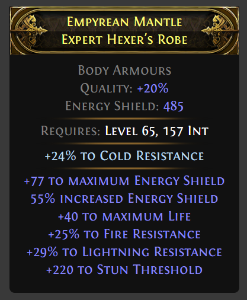

[](https://badge.fury.io/js/poe-item-display)

# Path of Exile 2 Item Display

This repo uses [poe-item-parser](https://github.com/Path-of-Tools/poe-item-parser) under the hood to generate the properties needed to display the items.

## Install

Install with your favorite package manager:

`npm install poe-item-display --save`

## Usage

> [!IMPORTANT]
> Currently only React is supported. More frameworks coming SOON!

```ts

const exampleItem = `CTRL-C item from in-game`;

import { PoE2Item } from 'poe-item-display/react';

function MyFancyItem() {
    return (
        <PoE2Item item={exampleItem} />
    )
}
```

## Example

This is an example of how the item will look like in practice

